<div align="center">

<picture>
  <source media="(prefers-color-scheme: dark)" srcset="./pai-logo.png">
  <source media="(prefers-color-scheme: light)" srcset="./pai-logo.png">
  
</picture>

<br/>
<br/>

# Personal AI Infrastructure

### Open-source scaffolding for building your own AI-powered operating system

<br/>

[](https://github.com/danielmiessler/Personal_AI_Infrastructure/releases)
[](LICENSE)
[](https://claude.ai/code)

<br/>

[**Quick Start**](#-quick-start) · [**Documentation**](#-documentation) · [**Examples**](#-examples) · [**Updates**](#-updates) · [**Community**](#-community)

<br/>

[](https://youtu.be/iKwRWwabkEc)

**[Watch the full PAI walkthrough](https://youtu.be/iKwRWwabkEc)** | **[Read: The Real Internet of Things](https://danielmiessler.com/blog/real-internet-of-things)**

---

# The best AI in the world should be available to everyone

</div>

Right now the most powerful AI setups are being built inside companies for efficiency and profits.

That's all good, but I think the purpose of technology is to serve humans—not the other way around. These new AI frameworks should be available to everyone, including people not in technology, so that regular people can use it to help them flourish.

That's what PAI is. It's the foundation for building a Personal AI System that understands your larger goals and context, gets better over time, and that works for *you* because it's *yours*. Not some generic chatbot. Not some common assistant. A full platform for magnifying yourself and your impact on the world.

**Related reading:**
- [The Real Internet of Things](https://danielmiessler.com/blog/real-internet-of-things) — The vision behind PAI (full book)
- [AI's Predictable Path: 7 Components](https://danielmiessler.com/blog/ai-predictable-path-7-components-2024) — Visual walkthrough of where AI is heading

<br/>

## What is PAI?

PAI (Personal AI Infrastructure) is an open-source template for building your own AI-powered operating system. It's currently built on [Claude Code](https://claude.ai/code), but designed to be platform-independent — the architecture, skills, and workflows are structured so future migrations to other AI platforms are straightforward.

<picture>
  <source media="(prefers-color-scheme: dark)" srcset="docs/images/skills-architecture.png">
  <source media="(prefers-color-scheme: light)" srcset="docs/images/skills-architecture.png">
  
</picture>

| Component | Description |
|-----------|-------------|
| **Skills** | Self-contained AI capabilities with routing, workflows, and documentation |
| **Agents** | Specialized AI personalities for different tasks (engineer, researcher, designer) |
| **Hooks** | Event-driven automation that captures work and manages state |
| **History** | Automatic documentation system (UOCS) that captures everything |

> [!TIP]
> **Start clean, small, and simple.** Build the scaffolding that makes AI reliable.

<br/>

## What's New in v0.9.0

Big updates! PAI is now fully **platform-agnostic** — your AI identity, your system.

| Feature | Description |
|---------|-------------|
| 📊 **Observability Dashboard** | Real-time agent monitoring with live charts |
| 🎭 **Genericized Identity** | Configure your DA name, it flows everywhere |
| ⚙️ **Better Configuration** | Clear docs for all environment variables |

👉 [**See full changelog**](#-updates)

<br/>


## 🚀 Quick Start

### 1. Clone PAI

```bash
git clone https://github.com/danielmiessler/Personal_AI_Infrastructure.git
cd Personal_AI_Infrastructure
```

### 2. Run the Setup Wizard

```bash
.claude/tools/setup/bootstrap.sh
```

The bootstrap script will:
- Check your shell (recommends zsh or bash)
- Install Bun if needed (PAI's package manager)
- Check for Claude Code
- Launch the interactive setup wizard

The setup wizard will:
- Ask where to install PAI (default: `~/.claude`)
- Configure your name and email
- Name your AI assistant (default: "Kai")
- Choose a color theme
- Set up voice server (macOS)
- Add environment variables to your shell

### 3. Add Your API Keys

```bash
# Copy environment template
cp ~/.claude/.env.example ~/.claude/.env

# Edit with your API keys
nano ~/.claude/.env
```

### 4. Start Claude Code

```bash
source ~/.zshrc  # Load PAI environment
claude
```

> [!TIP]
> **Non-interactive setup** for automation:
> ```bash
> bun run setup.ts --pai-dir ~/.claude --name "Your Name" --email you@example.com --force
> ```

📚 For detailed setup, see [`docs/QUICKSTART.md`](docs/QUICKSTART.md)

<br/>

## 📚 Documentation

All documentation lives in the CORE skill (`.claude/skills/CORE/`):

| Document | Description |
|----------|-------------|
| [**CONSTITUTION.md**](.claude/skills/CORE/CONSTITUTION.md) | System philosophy, architecture, operating principles |
| [**SkillSystem.md**](.claude/skills/CORE/SkillSystem.md) | **How to create your own skills** — the canonical skill structure guide |
| [**SKILL.md**](.claude/skills/CORE/SKILL.md) | Main PAI skill with identity, preferences, quick reference |
| [hook-system.md](.claude/skills/CORE/hook-system.md) | Event-driven automation |
| [history-system.md](.claude/skills/CORE/history-system.md) | Automatic work documentation (UOCS) |

<details>
<summary><strong>Additional Reference</strong></summary>

| Document | Description |
|----------|-------------|
| [prompting.md](.claude/skills/CORE/prompting.md) | Prompt engineering patterns |
| [aesthetic.md](.claude/skills/CORE/aesthetic.md) | Visual design system |
| [voice-server/README.md](.claude/voice-server/README.md) | Text-to-speech feedback |

</details>

<br/>

## 🎨 Examples

Explore example skills in `.claude/skills/`:

| Skill | Description |
|-------|-------------|
| **observability/** | Real-time agent monitoring dashboard with WebSocket streaming |
| **brightdata/** | Four-tier progressive web scraping with automatic fallback |
| **fabric/** | **Native Fabric patterns** — 248 patterns run directly in Claude's context (no CLI needed) |
| **research/** | Multi-source research workflows |
| **create-skill/** | Templates for creating new skills |

Each skill demonstrates the skills-as-containers pattern with routing, workflows, and self-contained documentation.

### Native Fabric Patterns

The Fabric skill now executes patterns **natively** within Claude Code — no CLI spawning required:

- **Your subscription's power** — Patterns run with your Opus/Sonnet model, not Fabric's configured model
- **Full context** — Patterns have access to your entire conversation history
- **Faster execution** — No process spawning overhead
- **248 patterns included** — extract_wisdom, summarize, threat modeling, and more

```bash
# Update patterns from upstream
.claude/skills/fabric/tools/update-patterns.sh
```

Only use `fabric` CLI for YouTube transcripts (`-y`) or pattern updates (`-U`).

<br/>

## 🏗️ The Thirteen Founding Principles

PAI is built on 13 foundational principles that define how to build reliable AI infrastructure.

Complete architecture documentation: [`.claude/skills/CORE/Architecture.md`](.claude/skills/CORE/Architecture.md)

---

### 1. Clear Thinking + Prompting is King

The quality of outcomes depends on the quality of thinking and prompts. Before any code, before any architecture—there must be clear thinking.

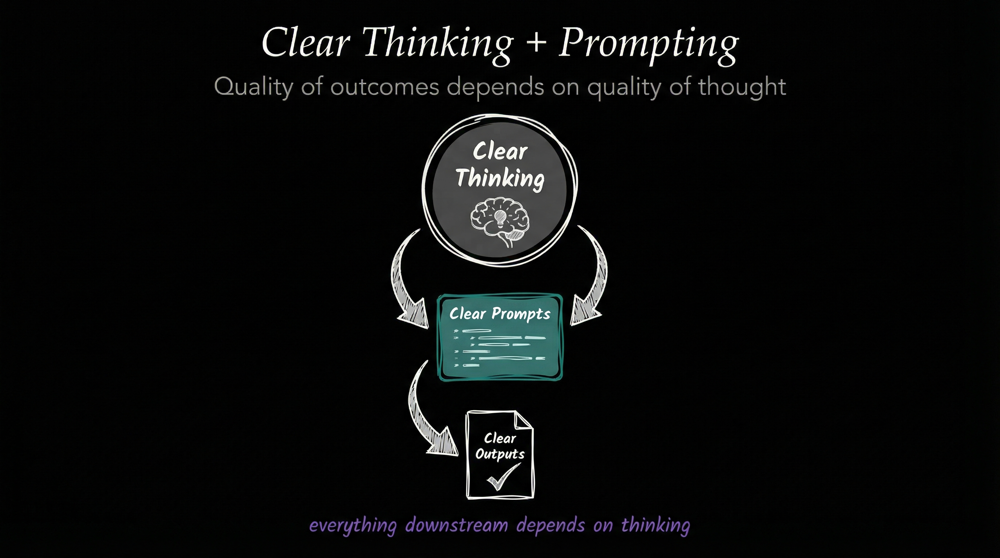

---

### 2. Scaffolding > Model

The system architecture matters more than the underlying AI model. A well-structured system with good scaffolding will outperform a more powerful model with poor structure.

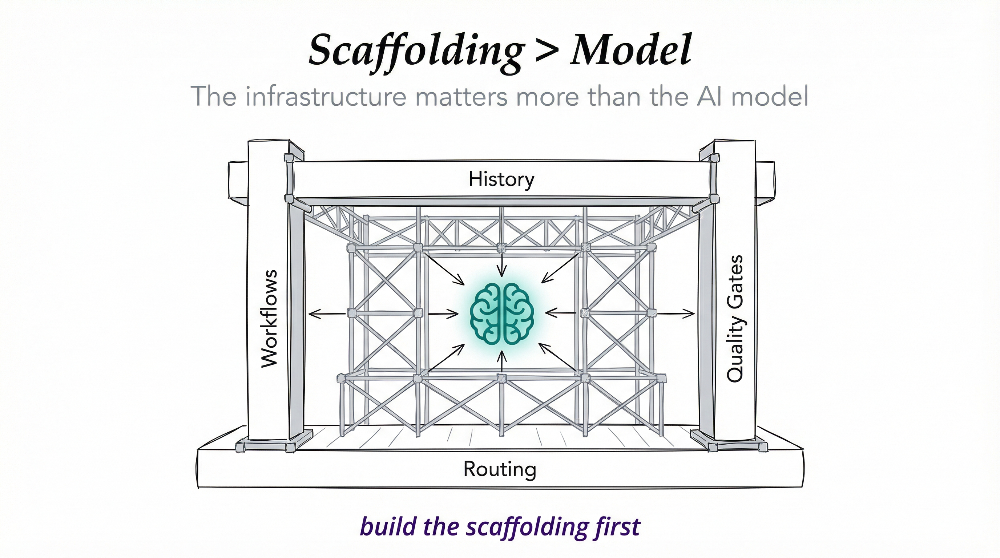 Model" width="100%">

---

### 3. As Deterministic as Possible

Favor predictable, repeatable outcomes over flexibility. Same input → Same output. Always.

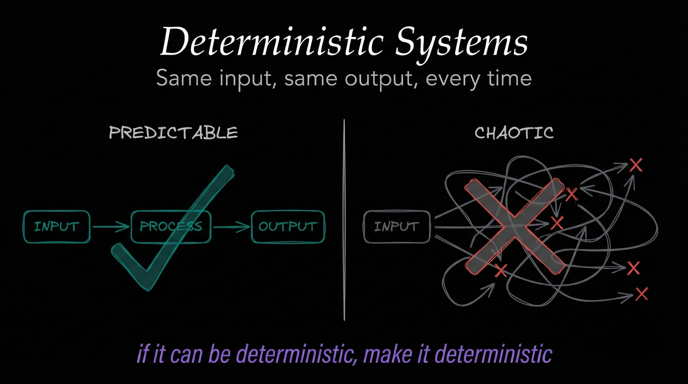

---

### 4. Code Before Prompts

Write code to solve problems, use prompts to orchestrate code. Prompts should never replicate functionality that code can provide.

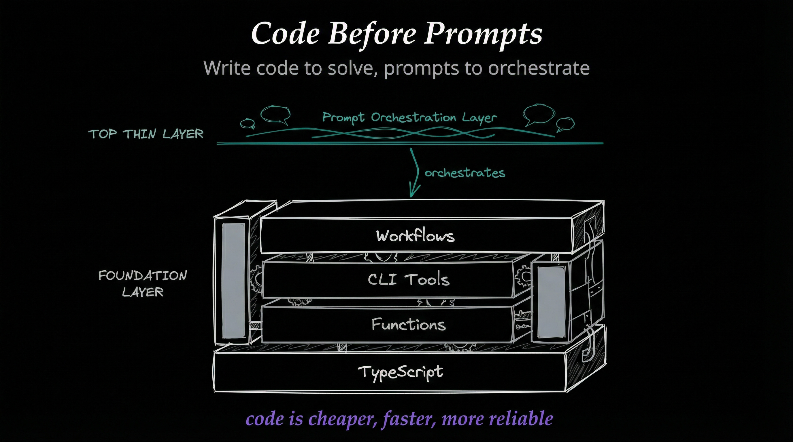

---

### 5. Spec / Test / Evals First

Define expected behavior before writing implementation. If you can't specify it, you can't test it. If you can't test it, you can't trust it.

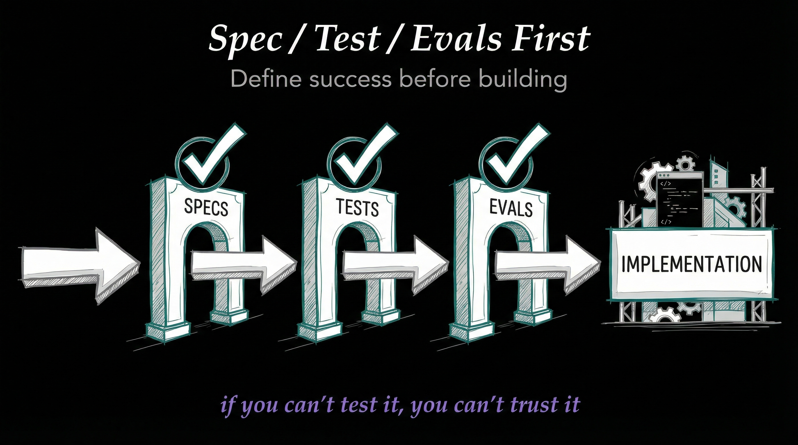

---

### 6. UNIX Philosophy

Do one thing well. Compose tools through standard interfaces. Build small, focused tools—compose them for complex operations.

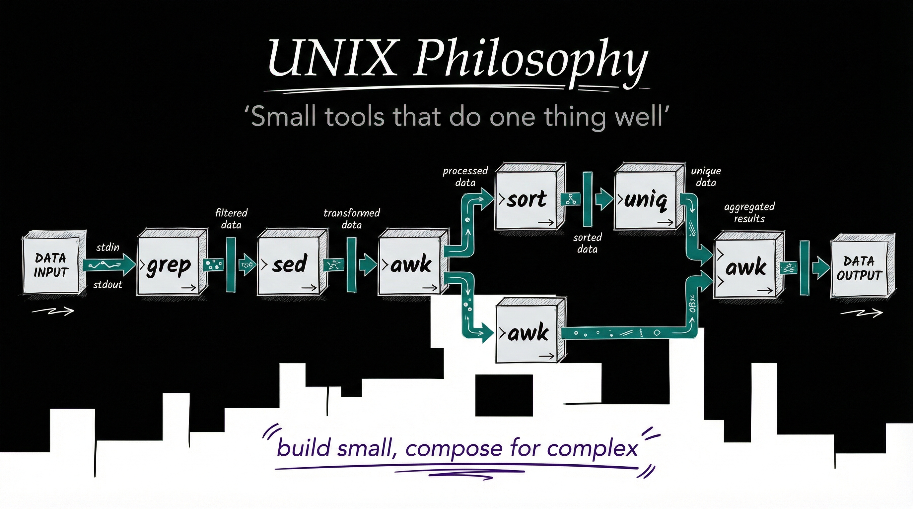

---

### 7. ENG / SRE Principles

Apply software engineering and site reliability practices to AI systems. AI infrastructure is infrastructure—treat it with the same rigor.

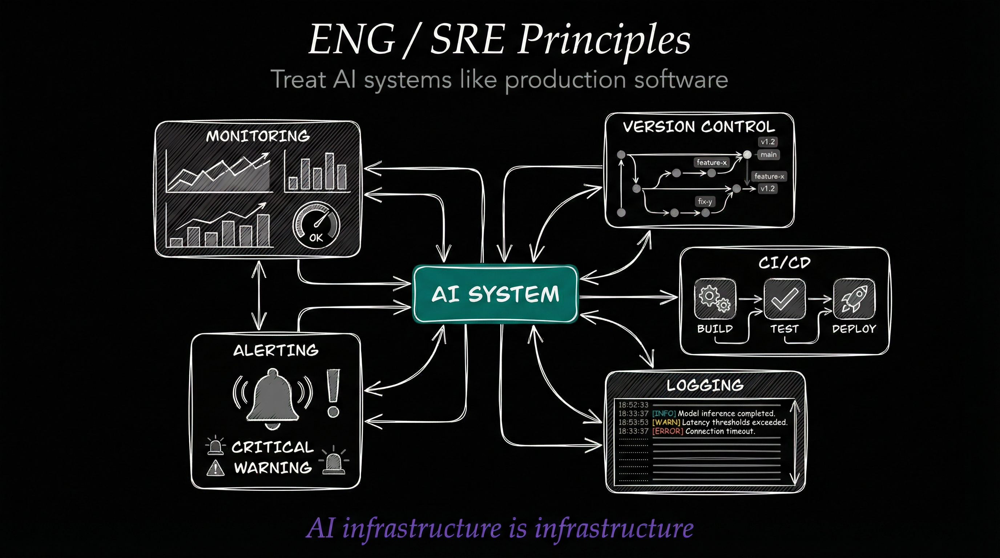

---

### 8. CLI as Interface

Every operation should be accessible via command line. If there's no CLI command for it, you can't script it or test it reliably.

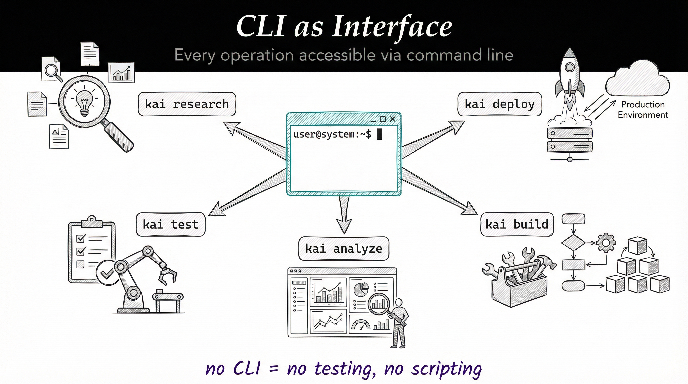

---

### 9. Goal → Code → CLI → Prompts → Agents

The proper development pipeline for any new feature. Each layer builds on the previous—skip a layer, get a shaky system.

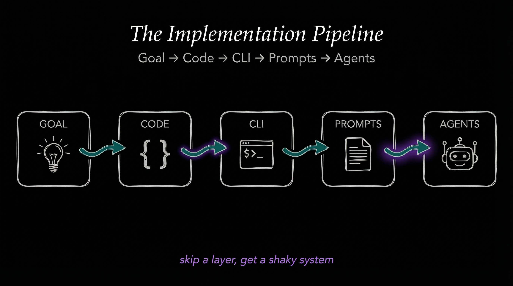

---

### 10. Meta / Self Update System

The system should be able to improve itself. A system that can't update itself will stagnate.

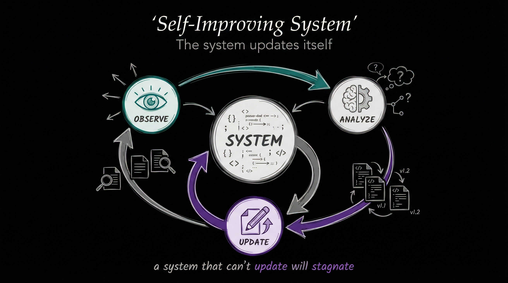

---

### 11. Custom Skill Management

Skills are the organizational unit for all domain expertise. Skills are how PAI scales—each new domain gets its own skill, maintaining organization as the system grows.

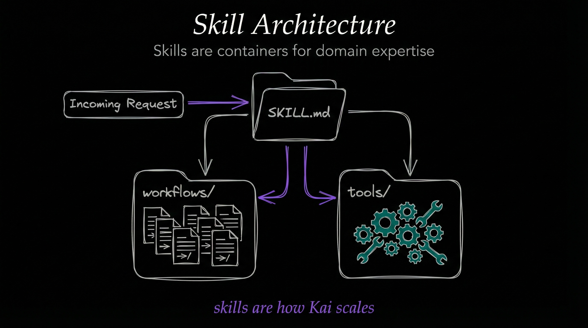

---

### 12. Custom History System

Automatic capture and preservation of valuable work. Memory makes intelligence compound. Without history, every session starts from zero.

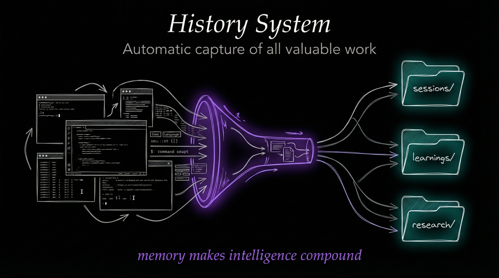

---

### 13. Custom Agent Personalities / Voices

Specialized agents with distinct personalities for different tasks. Personality isn't decoration—it's functional.

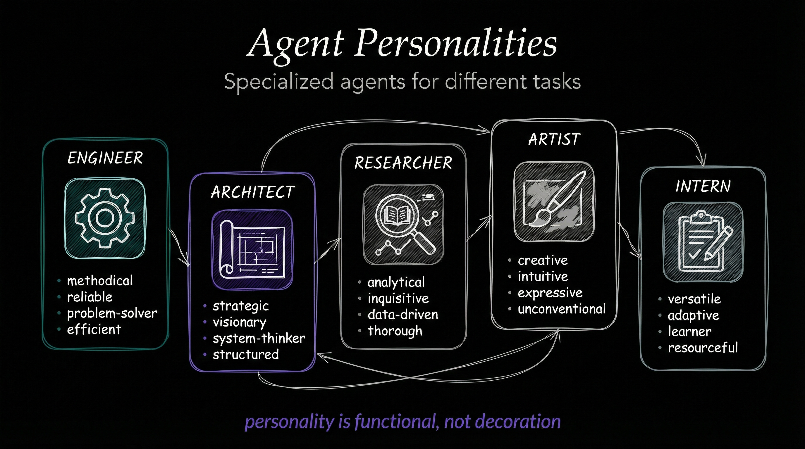

<br/>

## 🛠️ Technology Stack

| Category | Choice | Note |
|----------|--------|------|
| **Runtime** | Bun | NOT Node.js |
| **Language** | TypeScript | NOT Python |
| **Package Manager** | Bun | NOT npm/yarn/pnpm |
| **Format** | Markdown | NOT HTML for basic content |
| **Testing** | Vitest | When needed |
| **Voice** | ElevenLabs | TTS integration |

<br/>

## 💬 Community

Kai and I work hard to address issues and PRs throughout the week — we try not to get too far behind!

| Channel | Link |
|---------|------|
| 🐛 **Issues** | [Report bugs or request features](https://github.com/danielmiessler/Personal_AI_Infrastructure/issues) |
| 💬 **Discussions** | [Ask questions and share ideas](https://github.com/danielmiessler/Personal_AI_Infrastructure/discussions) |
| 🎥 **Video** | [Watch the full PAI walkthrough](https://youtu.be/iKwRWwabkEc) |
| 📝 **Blog** | [The Real Internet of Things](https://danielmiessler.com/blog/real-internet-of-things) |

<br/>

## 📝 Updates

<details>
<summary><strong>v0.9.0 (2025-12-01) — Platform Agnostic Release</strong></summary>

<br/>

This release focuses on making PAI fully portable and fork-friendly. Your AI, your identity, your system.

**Observability Dashboard**
- Complete real-time agent monitoring at `.claude/Observability/`
- WebSocket streaming of all agent activity
- Live pulse charts, event timelines, and swim lanes
- Multiple themes (Tokyo Night, Nord, Catppuccin, etc.)
- Security obfuscation for sensitive data

**Genericized Agent Identity**
- All agent references now use `process.env.DA || 'main'`
- No more hardcoded names — your DA name flows through the entire system
- Observability dashboard shows your configured identity

**Platform-Agnostic Configuration**
- Clear separation: `settings.json` for identity/paths, `.env` for API keys
- `DA` (Digital Assistant name) — your AI's identity
- `PAI_DIR` — root directory for all configuration
- `TIME_ZONE` — configurable timezone for timestamps

**Skill System Improvements**
- Canonical TitleCase file naming throughout
- Standardized skill-workflow-notification script for dashboard detection
- All paths use `${PAI_DIR}/` for location-agnostic installation

</details>

<details>
<summary><strong>v0.8.0 (2025-11-25) — Research & Documentation</strong></summary>

<br/>

**Research Skill**
- Comprehensive research skill with 10 specialized workflows
- Multi-source research with parallel agent execution
- Fabric pattern integration (242+ AI patterns)

**Infrastructure**
- Path standardization using `${PAI_DIR}/` throughout
- `PAI_CONTRACT.md` defining core guarantees
- Self-test validation system for health checks
- Protection system for PAI-specific files

</details>

<details>
<summary><strong>v0.7.0 (2025-11-20) — Protection & Clarity</strong></summary>

<br/>

**PAI Path Resolution System** (#112)
- Centralized `pai-paths.ts` library — single source of truth
- Smart detection with fallback to `~/.claude`
- Updated 7 hooks to use centralized paths

**PAI vs Kai Clarity** (#113)
- `PAI_CONTRACT.md` — official contract defining boundaries
- Self-test system (`bun ${PAI_DIR}/hooks/self-test.ts`)
- Clear README section distinguishing PAI from Kai

**Protection System**
- `.pai-protected.json` manifest of protected files
- `validate-protected.ts` script for pre-commit validation
- Pre-commit hook template for automated checks

</details>

<details>
<summary><strong>v0.6.5 (2025-11-18) — BrightData Integration</strong></summary>

<br/>

**Four-Tier Progressive Web Scraping**
- Tier 1: WebFetch (free, built-in)
- Tier 2: cURL with headers (free, more reliable)
- Tier 3: Playwright (free, JavaScript rendering)
- Tier 4: Bright Data MCP (paid, anti-bot bypass)

</details>

<details>
<summary><strong>v0.6.0 (2025-11-15) — Major Architecture Update</strong></summary>

<br/>

**Repository Restructure**
- Moved all configuration to `.claude/` directory
- Skills-as-containers architecture
- Three-tier progressive disclosure

**Skills System**
- Art skill with visual content generation
- Story-explanation skill for narrative summaries
- Create-skill and create-cli meta-skills

**Hook System**
- Comprehensive event capture system
- Session summary and tool output capture
- Tab title updates

**Voice Integration**
- Voice server with ElevenLabs TTS
- Session start notifications

</details>

<details>
<summary><strong>v0.5.0 and Earlier</strong></summary>

<br/>

**v0.5.0 — Foundation**
- CORE skill as central context loader
- Constitution defining system principles
- CLI-First Architecture pattern
- Initial skills: Fabric, FFUF, Alex Hormozi pitch

**Pre-v0.5.0 — Early Development**
- Initial repository setup
- Basic settings.json structure
- Agent personality definitions
- Foundational hook experiments

</details>

<br/>

## 📜 License

MIT License — see [`LICENSE`](LICENSE) for details.

<br/>

## 🙏 Acknowledgments

**Built on [Claude Code](https://code.claude.com) by Anthropic.**

PAI is the technical foundation for [Human 3.0](https://human3.unsupervised-learning.com) — a program I created to help people transform into a version of themselves that can thrive in the post-corporate world that's coming. Human 3.0 means AI-augmented humans who build and control their own AI systems.

Right now, the most sophisticated AI infrastructure exists inside corporations with massive engineering teams. PAI exists to change that. To give individuals the same scaffolding that companies spend millions building.

Your AI, knowing how you work, learning from your patterns, serving your goals — not some corporation's engagement metrics. That's what this enables.

<br/>

---

<div align="center">

**Start clean. Start small. Build the AI infrastructure you need.**

<br/>

[⬆ Back to Top](#personal-ai-infrastructure)

</div>
